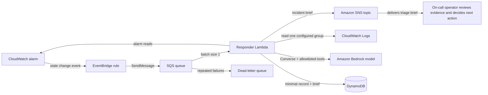
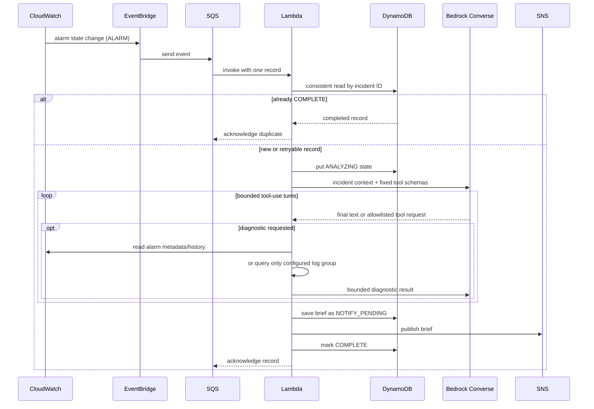

# High-Level Design (HLD)

## 1. Purpose and scope

Incident Triage Agent is an early-development, human-in-the-loop reference implementation for turning a CloudWatch alarm transition into a short, evidence-oriented incident brief. The first adapter is AWS-specific. The project name and future architecture are provider-neutral, but this release does not implement non-AWS cloud, observability, or model-provider adapters.

The system is decision support. It gathers a small, bounded set of read-only evidence, asks a configured model to summarize that evidence, stores the generated brief, and sends it to an SNS topic. An on-call engineer verifies the evidence and decides what to do. No model output is executed as a command or remediation.

### Goals

- Reduce the manual first-pass work after a CloudWatch alarm enters `ALARM`.
- Keep the agent's diagnostic capabilities explicit, read-only, and bounded.
- Preserve evidence and uncertainty in the generated brief so a human can verify it.
- Provide a small AWS SAM example that contributors can inspect and adapt.

### Non-goals for this release

- Autonomous remediation, deployment, scaling, restart, or resource mutation.
- A replacement for paging, incident command, ticketing, or established runbooks.
- Production guarantees for correctness, availability, exactly-once delivery, or cost.
- A complete secret/PII detector, multi-tenant service, or provider abstraction framework.
- Integrations with providers other than the AWS services listed below.

## 2. System context

The deployment lives in one AWS account and region. CloudWatch emits an alarm state-change event to EventBridge. The matching rule sends the event to SQS, which invokes a Lambda function. The Lambda reads alarm metadata/history and one configured log group, calls Amazon Bedrock Converse with tool use, stores an incident record in DynamoDB, and publishes a notification through SNS.

The operator subscribes intended responders to the SNS topic after deployment. The SAM template deliberately does not collect an email address or create a subscription.

## 3. Components and responsibilities

| Component | Responsibility | Trust / permission boundary |
| --- | --- | --- |
| CloudWatch alarm | Source of the triggering state transition and alarm identity | Existing AWS monitoring configuration |
| EventBridge rule | Select events whose source is CloudWatch and current state is `ALARM` | Sends only to the configured queue; queue policy restricts the source rule ARN |
| SQS queue | Buffers work, retries failed records, and isolates delivery from Lambda availability | Server-side encryption enabled; redrive to a DLQ after configured receives |
| Responder Lambda | Validates event shape, derives incident key, coordinates evidence, model analysis, persistence, and notification | Reserved concurrency; only the IAM actions in `template.yaml` |
| Diagnostic tools | Read the triggering alarm, its recent state transitions, or a bounded slice of one configured log group | Hard-coded tool names; no generic AWS API, shell, network, or mutation tool |
| Amazon Bedrock | Produces a structured natural-language analysis from the supplied incident context and tool results | Configured model ARN; request data includes alarm context and selected log excerpts |
| DynamoDB table | Stores the incident key, minimal alarm metadata, status, and generated brief | One table, on-demand capacity, server-side encryption; no TTL/backup policy in this sample |
| SNS topic | Delivers the generated brief to operator-managed subscriptions | Publish-only from Lambda; topic policy/subscriptions require deployment review |
| Dead-letter queue | Retains messages that exhausted SQS/Lambda retries for operator inspection | Encrypted; retention configured to 14 days |

## 4. End-to-end data flow

1. A CloudWatch alarm changes to `ALARM` and emits a state-change event.
2. EventBridge matches the event pattern and sends the event to the incident queue.
3. Lambda receives one SQS record. It parses the EventBridge body and requires an alarm name and ARN.
4. Lambda derives a stable incident key from the EventBridge event ID; if absent, it hashes alarm ARN, timestamp, and state.
5. Lambda checks DynamoDB. A previously completed item is treated as a duplicate and skipped. An incomplete item may be retried.
6. Lambda creates an `ANALYZING` record, then invokes the Bedrock Converse API with the alarm context and a fixed tool specification.
7. The model can request one of three diagnostics. Lambda dispatches only those named functions and constrains them to the triggering alarm or the configured log group.
8. Lambda returns each tool result to the model. The model returns a brief containing summary, evidence, recommended next steps, and confidence. The loop has configured turn and tool-call ceilings.
9. Lambda stores the brief with status `NOTIFY_PENDING`, publishes it to SNS, then marks the record `COMPLETE`.
10. If processing raises an error, Lambda reports that SQS item as failed. SQS retries it and eventually moves it to the dead-letter queue after the configured receive limit.

## 5. Agent design and trust boundaries

The model plans which available diagnostic tool to use and interprets the returned evidence. It does not receive AWS credentials and cannot directly invoke AWS APIs. The Lambda dispatcher maps only three known tool names to code-controlled SDK calls. The tool schemas constrain inputs, and the code applies additional clamps before a log request.

Alarm reasons, alarm history, and log messages are external operational data. They may contain misleading instructions or sensitive values. The system prompt treats them as untrusted evidence. A few regex patterns redact common AWS access keys, credential-like assignments, and email addresses, but redaction is best effort. Operators must use a suitable sanitized log group and review the data path before deployment.

The model-generated brief is also untrusted. It is sent as text to SNS and is not executed. Human operators must check cited evidence and validate recommendations against authoritative telemetry and runbooks.

## 6. Deployment, security, and operations

The SAM template creates the EventBridge rule, encrypted SQS queue and DLQ, Lambda function, encrypted DynamoDB table, SNS topic, and the queue policy. It accepts a model ARN and a single existing CloudWatch log group as parameters. The Lambda's permissions are split by purpose and scoped to the configured model, table, topic, and log group where the AWS APIs support resource-level scoping. CloudWatch alarm reads use `Resource: '*'` because the sample policy does not scope those read actions to a single alarm.

The template sets Lambda timeout to 120 seconds, memory to 512 MB, reserved concurrency to two, SQS batch size to one, and queue visibility timeout to 360 seconds. These are example values, not sizing recommendations. Operators must review service quotas, model availability, costs, retention, encryption, notification access, and the IAM policy for their account.

## 7. Limitations and evolution

- Sequential duplicate delivery is skipped after completion, but concurrent duplicate processing is possible because the sample has no conditional lease or lock.
- SNS publication and DynamoDB status updates are not transactional. A publish may succeed while the final status update fails, causing a retry and duplicate notification.
- The evidence sources are limited to CloudWatch alarm metadata/history and one log group. No metrics query, traces, deployment metadata, runbook retrieval, ticket, or chat integration is implemented.
- Redaction is not comprehensive; data minimization and source-log sanitization remain operator responsibilities.
- Provider portability is a future design direction. Adapters, contracts, configuration, and tests must be designed before describing the project as multi-provider.
- Production adoption requires evaluation datasets, structured tracing, concurrency/idempotency controls, retention/backup decisions, limits, monitoring, operational runbooks, and a security review.

## 8. Related documentation

- [Low-Level Design (LLD)](LLD.md) for event fields, code paths, tool inputs/outputs, record state, IAM actions, and failure semantics.
- [`template.yaml`](../template.yaml) is the deployable infrastructure source of truth.
- [`handler.py`](../handler.py) is the application behavior source of truth.
