# Low-Level Design (LLD)

## 1. Scope and implementation map

This document describes the current Python 3.12 Lambda implementation in [`handler.py`](../handler.py) and its AWS SAM resources in [`template.yaml`](../template.yaml). It is an implementation guide for the current early-development release, not a production specification. Where behavior is a limitation or a future hardening need, it is called out explicitly.

| Source | LLD areas |
| --- | --- |
| `lambda_handler` | SQS batch record parsing and partial-batch failure response |
| `_process_event` | Idempotency lookup, DynamoDB status changes, investigation, SNS delivery |
| `_event_context` / `_incident_id` | Required EventBridge fields, normalized context, incident key |
| `_investigate` | Bedrock Converse loop, bounded turns and tool dispatch |
| `_dispatch_tool` | Three fixed diagnostic operations and query bounds |
| `_redact` | Best-effort text redaction and excerpt truncation |
| `template.yaml` | Event routing, queue/DLQ, Lambda, data stores, and IAM |

## 2. Event contract

The queue body is expected to be an EventBridge CloudWatch alarm state-change event. Lambda's SQS adapter parses `record["body"]` as JSON and passes that object to `_process_event`.

| Path | Required | Use |
| --- | --- | --- |
| `id` | No | Preferred input for incident identity when non-empty |
| `time` | No | Fallback event timestamp when state timestamp is absent |
| `detail.alarmName` | Yes | Alarm name passed to CloudWatch read APIs and included in the brief |
| `detail.alarmArn` | Yes | Included as event context and used in fallback incident identity |
| `detail.state.value` | No | Current state; defaults to `UNKNOWN` |
| `detail.state.reason` | No | Current state reason; defaults to `No state reason supplied`, redacted and truncated |
| `detail.state.timestamp` | No | Preferred event timestamp; falls back to top-level `time`, then current UTC time |
| `detail.previousState.value` | No | Prior state; defaults to `UNKNOWN` |

If alarm name or ARN is missing, `_event_context` raises `ValueError`. For an SQS event, the record is returned in `batchItemFailures` so it can be retried and eventually sent to the DLQ. A malformed event can therefore consume retries; operator inspection is needed to distinguish poison messages from transient failures.

## 3. Incident identity and persistence model

`_incident_id` hashes the EventBridge ID if present. If it is absent or empty, it hashes the string `alarm_arn|timestamp|state`. The result is a SHA-256 hex string used as the DynamoDB partition key `IncidentId`.

### DynamoDB item fields

| Attribute | Type / purpose |
| --- | --- |
| `IncidentId` | String partition key; SHA-256 identity |
| `AlarmName` | Alarm name copied from event context |
| `AlarmArn` | Alarm ARN copied from event context |
| `State` | Current alarm state |
| `OccurredAt` | Selected event timestamp |
| `Status` | `ANALYZING`, `RETRYING`, `NOTIFY_PENDING`, or `COMPLETE` |
| `Summary` | Generated triage text, added before SNS publication |
| `UpdatedAt` | ISO-8601 UTC time of the last status write |

### Current state transitions

```mermaid
stateDiagram-v2
  [*] --> ANALYZING: new / incomplete incident
  ANALYZING --> RETRYING: investigation exception
  ANALYZING --> NOTIFY_PENDING: summary stored
  RETRYING --> ANALYZING: SQS redelivery
  NOTIFY_PENDING --> COMPLETE: SNS publish and final table update succeed
  NOTIFY_PENDING --> NOTIFY_PENDING: SNS or final update fails; SQS redelivers
  COMPLETE --> [*]
```

The handler first performs a consistent read. It skips an item only when its status is exactly `COMPLETE`. Otherwise, if a stored summary exists, it reuses that summary and retries notification without repeating model inference. If no summary exists, it writes an `ANALYZING` item and performs the investigation.

The read-then-put sequence is not a lock. Two concurrent deliveries can both observe a missing/incomplete record and invoke the model. Add a conditional lease or another concurrency-control mechanism before relying on deduplication under concurrent retries. SNS and DynamoDB are not an atomic transaction: after a successful publish and failed status update, a retry may publish the same brief again.

## 4. Investigation prompt and tool protocol

`_investigate` constructs a user message containing JSON with the normalized `incident` object and a short instruction to use read-only tools and cite evidence. It calls `bedrock.converse` with:

- `modelId` from `BEDROCK_MODEL_ARN`;
- a system prompt that distinguishes evidence and hypotheses, treats event text as untrusted, disallows remediation, and asks for Summary, Evidence, Recommended next steps, and Confidence headings;
- the fixed `TOOLS` schema;
- a maximum output size of 900 tokens per model response.

When the assistant response contains tool-use blocks, the handler invokes `_dispatch_tool` for each request, serializes the result as JSON, clips the result text to 12,000 characters, and returns it as a Bedrock tool result. The loop ends when a response has no tool-use blocks, reaches `MAX_TURNS` (6), or exceeds `MAX_TOOL_CALLS` (6). If the turn limit is reached without final text, the handler returns a fixed manual-review message.

### Tool contracts

| Tool | Model input | Code-enforced operation | Output / bounds |
| --- | --- | --- | --- |
| `describe_triggering_alarm` | Empty object; extra properties disallowed | `cloudwatch.describe_alarms` with only the event's alarm name | Returns a whitelist of alarm fields; returns an error object if no alarm is found |
| `get_triggering_alarm_history` | Empty object; extra properties disallowed | `cloudwatch.describe_alarm_history` for the same alarm, `StateUpdate`, maximum five records | Returns timestamp, summary, and data; summary/data are redacted and clipped |
| `search_allowed_log_group` | `filter_pattern` string max length 120 and `lookback_minutes` integer 5–30 | `logs.filter_log_events` for only `ALLOWED_LOG_GROUP`; time window clamped to 5–30 minutes; max 20 events | Returns selected messages and a `truncated` indicator based on pagination token; messages redacted and clipped |

An empty filter pattern is omitted from the CloudWatch Logs request. If no log group is configured, the operation returns a disabled error instead of searching. Unknown tool names return an error object. AWS client, value, and type errors are logged with the tool name and return only the exception class to the model; unexpected exceptions fail the record and use SQS retry behavior.

## 5. Redaction and bounds

`_redact` applies three regular-expression passes: AWS access-key-like values beginning `AKIA` or `ASIA`; assignments whose names resemble password, secret, token, or API key; and email addresses. It then truncates the resulting string to 2,400 characters. The same function is used for state reason, alarm history text, and each log event message.

This is not a complete secret/PII scanner. It does not establish that the selected source is safe, and it may miss or over-redact content. Only sanitized logs should be used for evaluation until a reviewed data-handling plan exists. Results are also clipped to 12,000 characters per tool result and the final summary to 6,000 characters.

## 6. Notification format

`_process_event` publishes one SNS message containing alarm name, previous/current state, timestamp, the generated summary, and a reminder that the output is AI-generated triage and any response must be manually verified and approved. Subject is `On-call analysis: <alarm> [<state>]`, clipped to the SNS 100-character subject limit. The template creates the topic but no subscription; an operator configures and confirms subscriptions separately.

## 7. SQS and Lambda failure behavior

The SAM SQS event source uses `BatchSize: 1` and `ReportBatchItemFailures`. For each record, Lambda parses the SQS body, processes it, and appends the message ID to `batchItemFailures` on any exception. A successful incident or completed duplicate is omitted from the failure list and acknowledged.

The queue visibility timeout is 360 seconds and Lambda timeout is 120 seconds. The queue redrive policy sends a message to the encrypted DLQ after `QueueMaxReceiveCount` (default 3, allowed 1–10) failed receives. These example settings should be re-evaluated for the target account, model latency, concurrency, and operational response policy.

Potential duplicate conditions:

- EventBridge/SQS delivery is at least once; repeated delivery is expected.
- Completed records are skipped only after a consistent DynamoDB read returns `COMPLETE`.
- Concurrent deliveries can both begin work because there is no conditional lock.
- SNS may have accepted a notification even if the following DynamoDB completion write fails; retry can send it again.
- Deterministic side-effect handling or a transactional outbox would need to be designed and evaluated for production.

## 8. Configuration and infrastructure mapping

| Setting / resource | Source | Current value or role |
| --- | --- | --- |
| `BedrockModelArn` | SAM parameter / Lambda env | Foundation model or inference profile ARN used by Converse |
| `LogGroupName` | SAM parameter / Lambda env | Single CloudWatch Logs group allowed to the application |
| `QueueMaxReceiveCount` | SAM parameter | Default 3, range 1–10 |
| `INCIDENT_TABLE` | Lambda environment | Name of the provisioned DynamoDB table |
| `NOTIFICATION_TOPIC_ARN` | Lambda environment | ARN of the SNS topic |
| `ResponderFunction` | SAM resource | Python 3.12, 120-second timeout, 512 MB, reserved concurrency 2 |
| `IncidentQueue` | SQS resource | Managed encryption, 360-second visibility timeout, DLQ redrive |
| `IncidentDeadLetterQueue` | SQS resource | Managed encryption, 14-day message retention |
| `IncidentTable` | DynamoDB resource | On-demand billing, string partition key, server-side encryption |
| `AlarmStateRule` | EventBridge rule | CloudWatch alarm state change where `detail.state.value` is `ALARM` |

### IAM actions in the template

| Statement | Actions | Resource scope |
| --- | --- | --- |
| Invoke configured model | `bedrock:InvokeModel` | `BedrockModelArn` parameter |
| Read alarm diagnostics | `cloudwatch:DescribeAlarms`, `cloudwatch:DescribeAlarmHistory` | `*` in this sample; narrow if supported and practical |
| Read configured logs | `logs:FilterLogEvents` | ARN formed from the one configured log group |
| Write incident records | `dynamodb:GetItem`, `dynamodb:PutItem`, `dynamodb:UpdateItem` | One incident table |
| Publish incident brief | `sns:Publish` | One notification topic |

The SQS event source mapping handles queue consumption; review the synthesized SAM/CloudFormation policies and resulting role before deployment. The template does not grant the function any resource-mutation actions.

## 9. Local change guidance and known gaps

Before adding a new event source or diagnostic tool, define its schema, bounds, permissions, redaction requirements, expected failures, and fixture data. Keep dispatch explicit; do not turn the model's tool name or arguments into arbitrary AWS API dispatch.

Known gaps include no automated evaluation suite, no lock/lease for concurrent duplicates, no SNS/DynamoDB transactional delivery mechanism, no explicit payload-size governance beyond code truncation, no log retention/TTL configuration, no alarm metric time-series retrieval, and no tracing/cost telemetry. These gaps are part of the current design and must not be described as solved.

## 10. Change checklist

For each implementation change, update both this LLD and [`HLD.md`](HLD.md) when component boundaries or data flows change. Update the README when deployment behavior, external services, cost, or security boundaries change. Use synthetic or sanitized fixtures only; never commit employer-internal details, production logs, credentials, or customer data.
