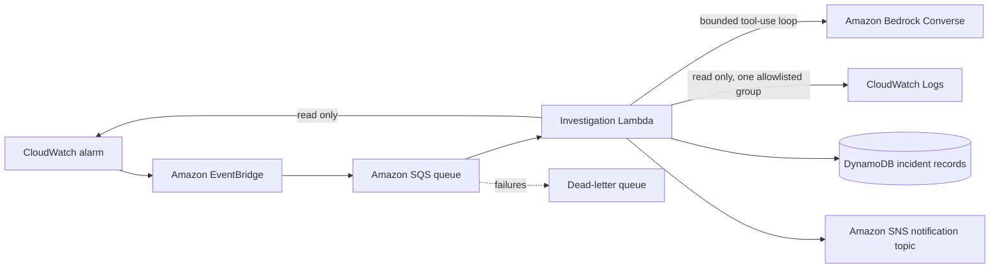

# Incident Triage Agent

**An open-source, provider-extensible reference implementation for AI-assisted on-call incident triage.** The first adapter targets AWS: it receives CloudWatch alarm state changes, gathers a bounded amount of read-only evidence, asks an Amazon Bedrock model to analyze that evidence, records a concise incident brief, and publishes the brief to Amazon SNS. The project name is provider-neutral; this initial release does not yet implement integrations for other clouds or model providers.

> **Status: early development (v0.1).** This repository is a starter implementation for learning and controlled evaluation. It is not a production incident-management system, an SRE substitute, or a guarantee that model-generated analysis is correct.

The project is independently designed from public AWS APIs and generic on-call workflows. It does not include code, prompts, data, infrastructure, or implementation details from any employer's internal systems.

## What it does

1. EventBridge matches CloudWatch alarm transitions to `ALARM` and sends them to an SQS queue.
2. Lambda consumes one event at a time and checks DynamoDB for a prior analysis of that incident.
3. A bounded Amazon Bedrock Converse tool-use loop can call only three fixed AWS diagnostic tools: describe the triggering alarm, read that alarm's recent state history, and search one operator-configured CloudWatch log group.
4. The application constrains each query, redacts a few common secret patterns, and limits the amount of evidence sent to the model.
5. The agent writes a short analysis and recommended next steps to DynamoDB, then publishes the same brief to SNS.

The model can request a tool, but the application executes only the hard-coded allowlist. **The v0.1 implementation is read-only:** it cannot restart, deploy, scale, modify, or delete AWS resources. Human operators remain responsible for deciding what to do.

## Architecture



## Repository layout

| File | Purpose |
| --- | --- |
| `handler.py` | SQS/EventBridge entry point, bounded Bedrock tool loop, fixed diagnostic tools, idempotency, storage, and notification |
| `template.yaml` | AWS SAM template for the queue, dead-letter queue, Lambda, DynamoDB table, SNS topic, EventBridge rule, and scoped IAM policies |
| `event-sample.json` | Example CloudWatch alarm event for manual review |
| [`docs/HLD.md`](docs/HLD.md) | High-level architecture, data flows, components, and trust boundaries |
| [`docs/LLD.md`](docs/LLD.md) | Low-level event contract, handler flow, tool contracts, state transitions, and failure behavior |
| `requirements.txt` | Python dependency declaration |
| `SECURITY.md` | Security boundaries and reporting guidance |
| `CONTRIBUTING.md` | Contribution expectations |

## Requirements

- An AWS account and a deployment role permitted to create the resources in `template.yaml`.
- AWS SAM CLI. Docker is needed only if you choose to use SAM local emulation.
- Python 3.12 for local development (the deployed function uses the Lambda Python 3.12 runtime).
- A Bedrock foundation model in the deployment region that supports the Converse API and tool use, with model access enabled for the account.
- A CloudWatch log group containing only data you are comfortable sending to your selected model. The stack grants log-reading access to the one log group you provide.

Bedrock inference is usage-billed. The AWS resources in this sample may also incur charges; this project does not promise a free deployment. Review current service pricing, quotas, model availability, and your organization's data-handling rules before deploying.

## Deploy to an isolated sandbox

Review `template.yaml`, the IAM statements, the selected model, the log group, and the data-flow section below before deployment. Start in a sandbox account with non-production alarms and sanitized logs.

```bash
sam build
sam deploy --guided
```

During the guided deploy, provide:

- `BedrockModelArn`: the ARN of a Bedrock foundation model that supports Converse tool use in the deployment region.
- `LogGroupName`: one existing log group that the investigation Lambda may search. The log-reading tool cannot choose a different group.
- `StackName`: for example `incident-triage-agent-dev`.

The template creates an SNS topic but does not subscribe an email address. After deployment, add a subscription in the SNS console and confirm it using the message sent by AWS. Keep that notification topic private to your intended responders.

The CloudWatch rule processes alarms in `ALARM` in the account and region where the stack is deployed. Start with one test alarm. You can inspect the SQS dead-letter queue and the Lambda CloudWatch Logs if an event cannot be analyzed.

## Example event

`event-sample.json` shows the EventBridge envelope expected by the queue. The application uses the alarm name, ARN, current/previous state, reason, and event time. Alarm reasons and log messages are treated as untrusted text, not as instructions.

## Investigation and safety model

- **Bounded reasoning:** at most six tool calls and six model turns per incident; log queries are limited to the configured group, a short lookback, and 20 returned events.
- **Fixed tools:** no shell, arbitrary HTTP, arbitrary AWS API dispatch, resource mutation, or model-supplied role assumption.
- **Resource boundary:** alarm tools are pinned to the alarm that triggered the event; the log tool is pinned to the configured log group.
- **Least privilege starting point:** the Lambda role is limited to the configured model ARN, one DynamoDB table, one SNS topic, CloudWatch alarm/metric reads, and the configured log group. Review and narrow permissions further for your account and model setup.
- **Human-operated response:** the model provides an incident brief and recommendations; it does not execute a remediation.
- **Bounded evidence:** excerpts are clipped, and the code redacts common AWS access-key, email, and credential-like patterns. This is a best-effort filter, **not** a complete PII or secret scanner. Use a sanitized log group and do not send regulated or sensitive records without an approved review.
- **Data handling:** alarm context and selected log excerpts are sent to the model configured by `BedrockModelArn`. The final brief and minimal incident metadata are stored in DynamoDB and sent to the SNS topic. Do not deploy until this data flow is acceptable for your environment.
- **Delivery and duplicates:** SQS provides at-least-once delivery, retries failures, and sends exhausted messages to a dead-letter queue. DynamoDB stores an incident key so sequential duplicate deliveries can reuse an existing brief. Concurrent duplicate delivery is still possible and should be addressed with a lease/lock before production use.

Treat model output as a hypothesis to verify against source metrics, logs, runbooks, and an operator's judgment. This version has no automated validation of diagnostic correctness.

## Configuration and limitations

- One log group per deployment; split deployments or extend the allowlist deliberately if you need more.
- CloudWatch alarm metrics, histories, and selected log events are the only diagnostic sources in v0.1.
- Alarm-metric math expressions, composite alarms, multi-account observability, incident chat integrations, runbook retrieval, evaluations, and automated remediation are not implemented.
- The handler is intentionally compact. Add structured tracing, retention controls, rate limits, model-specific evaluations, and operational dashboards before considering production use.
- Set CloudWatch log retention and DynamoDB backup/retention policies to match your organization's requirements.

## Roadmap

- [ ] Add a local synthetic-event mode that does not call AWS or a model.
- [ ] Add redacted fixture scenarios and measurable evaluation criteria for analysis quality.
- [ ] Add optional runbook retrieval with explicit source attribution.
- [ ] Add an operator review workflow for approving remediation proposals (proposals only; no direct execution by default).
- [ ] Add OpenTelemetry-compatible trace and cost reporting.
- [ ] Document multi-account deployments and stronger tenant/data isolation.

## AWS references

- [Amazon Bedrock Converse API](https://docs.aws.amazon.com/bedrock/latest/userguide/conversation-inference.html)
- [Amazon Bedrock tool use](https://docs.aws.amazon.com/bedrock/latest/userguide/tool-use.html)
- [CloudWatch events delivered to EventBridge](https://docs.aws.amazon.com/eventbridge/latest/ref/events-ref-cloudwatch.html)
- [Amazon SQS dead-letter queues](https://docs.aws.amazon.com/AWSSimpleQueueService/latest/SQSDeveloperGuide/sqs-dead-letter-queues.html)
- [AWS SAM documentation](https://docs.aws.amazon.com/serverless-application-model/latest/developerguide/what-is-sam.html)

## Design documentation

- [High-Level Design (HLD)](docs/HLD.md)
- [Low-Level Design (LLD)](docs/LLD.md)

## Contributing

Contributions are welcome. Please read [`CONTRIBUTING.md`](CONTRIBUTING.md) and [`SECURITY.md`](SECURITY.md) first. Keep default integrations read-only, document every permission and data flow, and include sanitized fixtures for new event types.

## License

This project is licensed under the MIT License. See [`LICENSE`](LICENSE).
